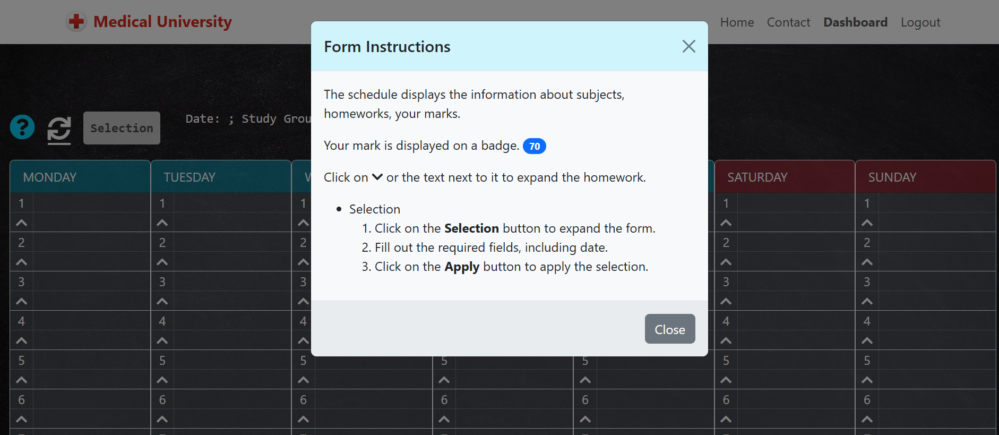
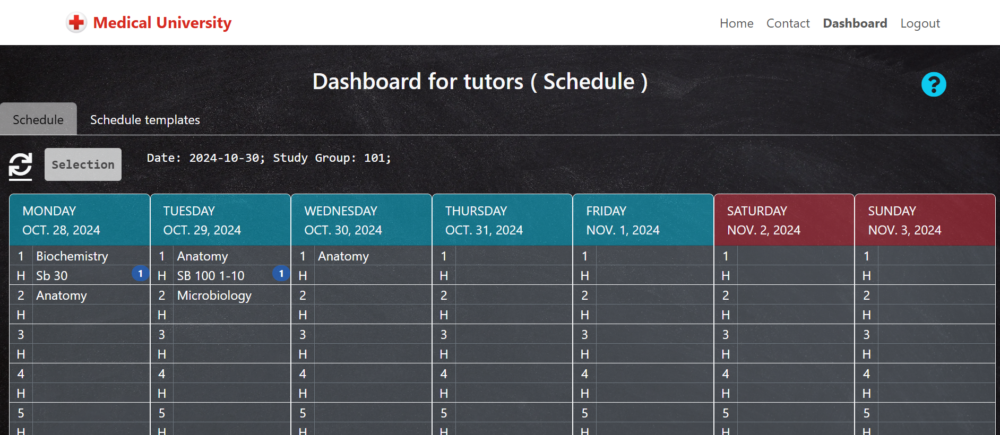
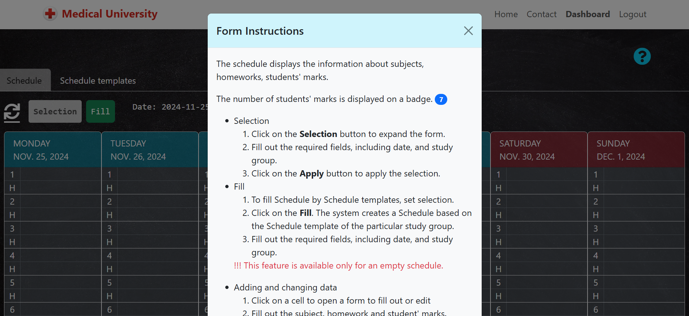
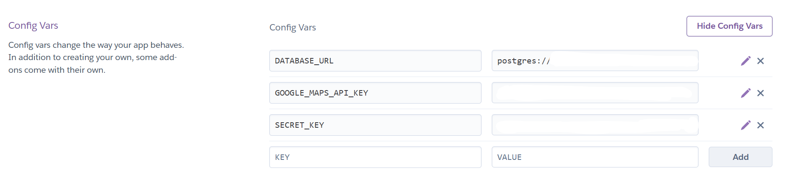

# MEDICAL UNIVERSITY

Medical University is a website that describes the university's general information and allows tutors and students to store a schedule and students' marks. Tutors can add, edit, and delete the class schedule, homework and students' marks. Students can see the class schedule and their marks.

The website can be accessed by this [link](https://uni-flow-323277c94698.herokuapp.com/)
The repository can be accessed by this [link](https://github.com/BogdanovaIV/UniFlow)


## User Stories
### First Time Visitors

| **ID** | **User Story** | **Acceptance Criteria** |
|-|-|-|
| [1](https://github.com/BogdanovaIV/UniFlow/issues/1) | As a Site User, I can click on the Home link so that I can read information about the university. | AC1: When the Home link is clicked, the text about the university is visible.|
| [2](https://github.com/BogdanovaIV/UniFlow/issues/2) | As a Site User, I can click on the Contact link so that I can read the Contact information and find Google Maps with the location. | AC1: When the Contact link is clicked, the Contact information is visible. <br> AC2: Google Maps shows the correct coordinates. |
| [13](https://github.com/BogdanovaIV/UniFlow/issues/13) | As a Site User, I want to create an account and log in, and if my account hasn't been verified by an administrator, I want to see a message informing me about the verification status. | AC1: When the user creates an account, they can log in. <br> AC2: If checked is False, the system shows a pending approval message. <br> AC3: If checked is True, the user can access the system. |

### Returning or Regular Visitors

| **ID** | **User Story** | **Acceptance Criteria** |
|-|-|-|
| [1](https://github.com/BogdanovaIV/UniFlow/issues/1) | As a Site User, I can click on the Home link so that I can read information about the university. | AC1: When the Home link is clicked, the text about the university is visible. |
| [2](https://github.com/BogdanovaIV/UniFlow/issues/2) | As a Site User, I can click on the Contact link so that I can read the Contact information and find Google Maps with the location. | AC1: When the Contact link is clicked, the Contact information is visible. <br> AC2: Google Maps shows the correct coordinates. |

### Tutor

| **ID** | **User Story** | **Acceptance Criteria** |
|-|-|-|
| [9](https://github.com/BogdanovaIV/UniFlow/issues/9) | As a Tutor, I want to view the schedule for a selected week, including subjects, homework availability, and the number of grades given, so that I can plan my teaching tasks. | AC1: Tutors can choose a week to view the schedule. <br> AC2: Schedule shows subjects, homework status, and grade count. |
| [10](https://github.com/BogdanovaIV/UniFlow/issues/10) | As a Tutor, I want to fill out the weekly schedule based on schedule templates and edit it by adding, updating, and deleting rows. | AC1: Tutors can fill the schedule using the template. <br> AC2: Tutors can add, update, or delete rows in the schedule. |
| [11](https://github.com/BogdanovaIV/UniFlow/issues/11) | As a Tutor, I want to assign marks to students by subject and date, and I can create, read, update, and delete marks. | AC1: Tutors can create student marks. <br> AC2: Tutors can read student marks. <br> AC3: Tutors can update student marks. <br> AC4: Tutors can delete student marks. |
| [16](https://github.com/BogdanovaIV/UniFlow/issues/16) | As a Tutor, I want to view the schedule template for a selected term and study group. | AC1: Tutors can choose a term and study group to view the schedule template. <br> AC2: The template shows subjects by weekdays. |
| [17](https://github.com/BogdanovaIV/UniFlow/issues/17) | As a Tutor, I want to edit schedule templates by adding, updating, and deleting rows. | AC1: Tutors can create new rows, update existing rows, and delete rows in the template. |

### Student

| **ID** | **User Story** | **Acceptance Criteria** |
|-|-|-|
| [12](https://github.com/BogdanovaIV/UniFlow/issues/12) | As a Student, I can view my schedule, marks, and homework assignments, so that I can track my academic progress. | AC1: Students can view their weekly schedule. <br> AC2: Students can view their marks for each subject. <br> AC3: Students can view their homework assignments. |

### Administrator

| **ID** | **User Story** | **Acceptance Criteria** |
|-|-|-|
| [3](https://github.com/BogdanovaIV/UniFlow/issues/3) | As a Site Admin, I can create, read, update, and delete terms that tutors choose in other tables. | AC1: Admins can create a term. <br> AC2: Admins can read a term. <br> AC3: Admins can update a term. <br> AC4: Admins can delete a term. <br> AC5: Term names must be unique. <br> AC6: `date_from` must precede `date_to`. <br> AC7: No overlapping terms are allowed. <br> AC8: Validation messages must explain invalid date ranges or overlaps. |
| [4](https://github.com/BogdanovaIV/UniFlow/issues/4) | As a Site Admin, I can create, read, update, and delete study groups that tutors choose in other tables. | AC1: Admins can create a study group. <br> AC2: Admins can read a study group. <br> AC3: Admins can update a study group. <br> AC4: Admins can delete a study group. |
| [5](https://github.com/BogdanovaIV/UniFlow/issues/5) | As a Site Admin, I can assign a study group to a user and set their checked status. | AC1: Admins can assign groups to users and set their checked status. |
| [6](https://github.com/BogdanovaIV/UniFlow/issues/6) | As a Site Admin, I can create, read, update, and delete schedule templates that tutors use as default schedules. | AC1: Admins can create a schedule template. <br> AC2: Admins can read a schedule template. <br> AC3: Admins can update a schedule template. <br> AC4: Admins can delete a schedule template. |
| [7](https://github.com/BogdanovaIV/UniFlow/issues/7) | As a Site Admin, I can create, read, update, and delete schedules. | AC1: Admins can create a schedule. <br> AC2: Admins can read a schedule. <br> AC3: Admins can update a schedule. <br> AC4: Admins can delete a schedule. <br> Requirement: No duplicate subjects should appear on the same date. |
| [8](https://github.com/BogdanovaIV/UniFlow/issues/8) | As a Site Admin, I can create, read, update, and delete student marks. | AC1: Admins can create a student mark. <br> AC2: Admins can read a student mark. <br> AC3: Admins can update a student mark. <br> AC4: Admins can delete a student mark. <br> Restriction: One score per subject per student per date. |
| [14](https://github.com/BogdanovaIV/UniFlow/issues/14) | As a Site Admin, I want to create predefined user groups, so that I can easily manage user roles and permissions within the application. | AC1: Groups are created automatically during migrations. <br> AC2: The system avoids duplicate group creation. |
| [15](https://github.com/BogdanovaIV/UniFlow/issues/15) | As a Site Admin, I can create, read, update, and delete subjects. | AC1: Admins can create a subject. <br> AC2: Admins can read a subject. <br> AC3: Admins can update a subject. <br> AC4: Admins can delete a subject. |

## Features

### Existing Features

__Navigation Bar__
 
 - This section is on all pages.
 - This section contains an image logo and links: the Logo, the "Home" page, the "Contact" page, the "Register" (the user is not authorized) page, the "Login" (the user is not authorized) page, the "Dashboard" (the user is authorized) page and the "Logout" button (the user is authorized).
 - All buttons have a hover effect.
 - The button has a bold font when it is according to the opened page. 
 - This section has a drop-down menu for small-size devices.
 - The navigation allows the user to easily get targets without having to revert back to the previous page via the ‘back’ button.
   
   
   

__The Footer__

 - The footer section includes links to the relevant social media sites for Medocal University. The links will open in a new tab to allow easy navigation for the user.
  

 - Links have a hover effect: changing color.
  

__The Home Page__

 - The page contains relevant detailed information about the University.
  

__The Contact Page__

 - The page contains relevant information about the address, the phone, the e-mail, and the map with the location.
  

__The Register Page__

 - The page registers a new user on the website. The user has to fill out the e-mail which is login, the first name, the last name, and the password. 
  

__The Login Page__

 - The page allows the user to authenticate on the website. The user has to fill out the login which is the e-mail and the password. 
  

__The Dashboard Page (Student)__

 - The page displays the weekly schedule containing subjects, homework, and marks of the user. 
 - There are three buttons: Instruction, Update, and Selection. The buttons have tooltips with short descriptions.
  
 - The "Instruction" button displays the instructions on how to work with this page to the user.
  
 - The "Update" button updates information on the dashboard.
 - When the user clicks on the "Selection" button, it expands and displays a selection that the user has to fill out.
  
 - the "Homework" link has a hover effect
  
 - When the user clicks on the "Homework" link, it expands and displays the whole text.
  
 - The blue oval contains the student's mark.
  

__The Dashboard Page (Tutor)__
 - The page gives the features: add, edit, and delete schedules and schedule templates.
 - It contains two pages: Schedule and Schedule templates.
 **Schedule templates**
 Schedule templates are used to fill out Schedules by template and save the user time. It contains the weekly schedule template with subjects and three buttons: Instruction, Update, and Selection.
 
- The "Instruction" button displays the instructions on how to work with this page to the user.
  
 - The "Update" button updates information on the dashboard.
 - When the user clicks on the "Selection" button, it expands and displays a selection that the user has to fill out.
  
 - The cells in the table have a hover effect
  
 - When the user clicks on an empty cell, the system opens the "Add schedule template" page. The user has to fill in a subject and click the "Save" button to add a new item. If the user changes their decision, they can click on the "Cancel" button not to add anything. 
  
- the "Add schedule template" page has the "Instruction" button that, when pressed, opens a instruction window.
  
- When the user clicks on a filled cell, the system opens the "Edit schedule template" page. The user has to change a subject and click the "Save" button to edit this item. If the user changes a decision, they can click on the "Cancel" button not to edit anything. Also, this form has the "Delete" button which deletes the current item. When the user clicks on it, the system displays a confirmation form. 
  
  
- the "Edit schedule template" page has the "Instruction" button that, when pressed, opens a instruction window.
  
**Schedule**
 Schedule contains the weekly schedule with subjects, homeworks, numbers of students' marks and four buttons: Instruction, Update, Fill and Selection.
 
- The "Instruction" button displays the instructions on how to work with this page to the user.
  
 - The "Update" button updates information on the dashboard.
 - The "Fill" button is available only for an empty schedule. When the user clicks it, the system creates a Schedule based on the Schedule template of the particular study group.
  
 - When the user clicks on the "Selection" button, it expands and displays a selection that the user has to fill out.
  
 - The cells in the table have a hover effect
  
 - When the user clicks on an empty cell, the system opens the "Add schedule" page. The user has to fill in a subject, a homework (optional), and click the "Save" button to add a new item. If the user changes their decision, they can click on the "Cancel" button not to add anything. After saving the system opens the "Edit schedule" form which allows to fill in students' marks.
  
 - the "Add schedule" page has the "Instruction" button that, when pressed, opens a instruction window.
  
 - When the user clicks on a filled cell, the system opens the "Edit schedule" page. The user has to change a subject (optional), a homework (optional)  and click the "Save" button to edit this item. If the user changes a decision, they can click on the "Cancel" button not to edit anything. Also, this form has the "Delete" button which deletes the current item. When the user clicks on it, the system displays a confirmation form. 
  
  
 - the "Edit schedule" page has the "Instruction" button that, when pressed, opens a instruction window.
  
 - To add, edit, or delete students' marks, the user has to open the "Edit schedule" page. It displays a students' marks table.
 - To add a new mark, the user has to click the "Add" button and fill in a student and their mark.
  
 - To edit the mark, the user has to click the "Edit" button and change fields.
  
 - To delete the mark, the user has to click the "Delete" button and confirm action.
  
__The Admin page__
This page allows supper-users to administrate a database and add, edit, and delete information in dictionaries which they are responsible  for.
 - **Users** contains information about all users. The supper-user can set permissions for users and ban if it is necessary (uncheck active). The system has two group permissions: Tutor and Student which give the appropriate access rights.
  
  
 - **User profiles** contains information about the student's study group and has the "checked" checkbox which allows students to see their schedules. If  the "checked" checkbox is not selected, the user sees messages that their accounts are under inspection.
  
  
 - **Terms** contains information about study terms with fields: name, date from, date to, and active. If The "active" checkbox is not selected, this option is not displayed for tutors to select.
 
 - **Study groups** contains information about study groups with fields: name and active. If The "active" checkbox is not selected, this option is not displayed for tutors to select.
 
 - **Subjects** contains information about subjects with fields: name and active. If The "active" checkbox is not selected, this option is not displayed for tutors to select.
 

## Design
The design of the application follows a modern and clean aesthetic, utilizing Bootstrap's standard font and a custom color palette for consistency and user-friendly interface design.

### Color Palette

| Color Name | Hex Code  | Influence on Design |
|-|-|-|
| **Primary Blue** | `#0D6EFD` | Adds vibrancy and draws attention to buttons, links, and primary accents. |
| **Light Gray** | `#EEF0EF` | Creates a calm and clean atmosphere for the overall layout. |
| **Dark Gray** | `#49454B` | Provides a neutral and elegant background that highlights foreground elements. |
| **White** | `#FFFFFF` | Ensures clarity and contrast for text and main content areas. |
| **Red Accent** | `#D82A21` | Adds a bold and dynamic touch to footer links and the logo, making them memorable. |

### Typography
The application uses Bootstrap's default font family, which is optimized for readability and consistent styling across various browsers and devices. The font stack typically includes:
```
font-family: -apple-system, BlinkMacSystemFont, "Segoe UI", Roboto, "Helvetica Neue", Arial, sans-serif;
```
## Technologies Used

### Backend
- [Python 3.12.2](https://www.python.org/downloads/release/python-3122/): A versatile and widely-used programming language known for its readability and extensive libraries. This project is primarily built using Python due to its powerful data manipulation capabilities and ease of integration with other technologies.
- [Django 4.x](https://www.djangoproject.com/): A high-level Python web framework that encourages rapid development and clean design. Django is used to manage the core application logic, database interactions, and routing, enabling efficient handling of complex backend functionalities.

### Frontend
- [HTML5 & CSS3](https://developer.mozilla.org/en-US/docs/Web): Used to structure the web pages and style them to ensure a visually appealing and user-friendly interface. Semantic HTML5 tags provide a solid foundation, while CSS3 enables responsive and consistent styling.
- [JavaScript](https://developer.mozilla.org/en-US/docs/Web/JavaScript): Enables client-side scripting to add interactivity and dynamic elements on the website. JavaScript is used for real-time form validations, UI animations, and responsive features across devices.
- [Bootstrap 5.x](https://getbootstrap.com/): A popular CSS framework that accelerates frontend development. Bootstrap provides pre-styled components and responsive grid systems, ensuring consistent and mobile-friendly UI elements.
- [Google Maps JavaScript API](https://developers.google.com/maps): Google Maps is integrated to provide interactive maps that enhance the application's user experience, such as displaying the university’s location or directions. By utilizing the JavaScript API, the project can dynamically load maps and customize the map view based on user interaction and location data, making it a valuable addition for location-based features.

### Database
- [PostgreSQL](https://www.postgresql.org/): An advanced, open-source relational database system chosen for its scalability and SQL compliance. PostgreSQL is used to store and manage all user, schedule, and resource data, with Django ORM handling queries and migrations.

### Authentication & Authorization
- [Django-Allauth](https://django-allauth.readthedocs.io/en/latest/): A comprehensive library used for managing user authentication, registration, and account management. Django-Allauth is utilized to streamline the process of user sign-up, login, and role-based access control.
- [Django Permissions](https://docs.djangoproject.com/en/5.1/topics/auth/default/#permissions): The project utilizes Django’s built-in permissions system to control access to specific views and actions within the application. PermissionRequiredMixin from django.contrib.auth.mixins is used to restrict access to certain views, allowing only users with the necessary permissions to proceed.

# Design Architecture
This project uses **PostgreSQL** as the database backend and defines models for managing terms, study groups, schedules, and student marks in an academic environment.

## Data Model

### Entity-Relationship (ER) Diagram

### **StudyGroup**
Represents a study group.

| Field Name | Data Type | Constraints | Description |
|-|-|-|-|
| `id` | Primary Key | Auto-increment | Unique identifier for the group.|
| `name` | CharField(100) | Unique, Not Null | Name of the study group. |
| `active` | BooleanField | Default = True | Indicates if the group is active.|

- **Meta:**
  - **Ordering:** By `name`.

---

### **Term**
Represents an academic term.

| Field Name | Data Type | Constraints | Description |
|-|-|-|
| `id` | Primary Key | Auto-increment | Unique identifier for the term. |
| `name` | CharField(100) | Unique, Not Null | Name of the academic term. |
| `date_from` | DateField | Unique, Not Null | Start date of the term. |
| `date_to` | DateField | Unique, Not Null | End date of the term. |
| `active` | BooleanField | Default = True | Indicates if the term is active. |

- **Meta:**
  - **Ordering:** By `date_from`.
  - **Constraints:** Enforces non-overlapping terms and valid date ranges.

---

### **Subject**
Represents a subject.

| Field Name | Data Type | Constraints | Description |
|-|-|-|-|
| `id` | Primary Key | Auto-increment | Unique identifier for the subject.|
| `name` | CharField(100) | Unique, Not Null | Name of the subject. |
| `active` | BooleanField | Default = True | Indicates if the subject is active.|

- **Meta:**
  - **Ordering:** By `name`.

---

### **ScheduleTemplate**
Represents a schedule template for a specific term and study group.

| Field Name | Data Type | Constraints | Description |
|-|-|-|
| `id` | Primary Key | Auto-increment | Unique identifier for the schedule template.  |
| `term` | ForeignKey(Term) | Not Null | Associated academic term. |
| `study_group` | ForeignKey(StudyGroup) | Not Null | Associated study group. |
| `weekday` | IntegerField | Choices (0-6, Mon-Sun) | Day of the week for the schedule. |
| `order_number`| PositiveIntegerField | Between 1-10, Not Null | Order of the class for the day. |
| `subject` | ForeignKey(Subject)| Not Null | Associated subject. |

- **Meta:**
  - **Ordering:** By `term`, `study_group`, `weekday`, `order_number`.
  - **Constraints:** Unique combination of `term`, `study_group`, `weekday`, `order_number`.

---

### **Schedule**
Represents a daily schedule for a study group.

| Field Name | Data Type | Constraints | Description |
|-|-|-|-|
| `id` | Primary Key | Auto-increment | Unique identifier for the schedule. |
| `study_group` | ForeignKey(StudyGroup) | Not Null | Associated study group. |
| `date` | DateField | Not Null | Date of the schedule. |
| `order_number`| PositiveIntegerField | Between 1-10, Not Null | Order of the class for the day. |
| `subject` | ForeignKey(Subject)| Not Null | Associated subject. |
| `homework` | TextField | Optional | Homework assigned for the class. |

- **Meta:**
  - **Ordering:** By `study_group`, `date`, `order_number`.
  - **Constraints:** Unique combination of `study_group`, `date`, `order_number`.

---

### **StudentMark**
Represents a student's performance in a schedule.

| Field Name | Data Type | Constraints | Description  |
|-|-|-|-|
| `id` | Primary Key | Auto-increment | Unique identifier for the student mark. |
| `student` | ForeignKey(User)  | Not Null | Associated student. |
| `schedule` | ForeignKey(Schedule)| Not Null | Associated schedule. |
| `mark` | PositiveIntegerField | Between 0-100, Not Null | Mark awarded to the student. |

- **Meta:**
  - **Ordering:** By `schedule`, `student`.
  - **Constraints:** Unique combination of `schedule`, `student`.

---

### **WeekdayChoices**
Enumeration for days of the week.

| Value | Name |
|-|-|
| 0 | Monday |
| 1 | Tuesday |
| 2 | Wednesday |
| 3 | Thursday |
| 4 | Friday |
| 5 | Saturday |
| 6 | Sunday |

---

### Indexes
1. **`term_study_group_idx`**: Optimizes queries for the combination of `term` and `study_group` in `ScheduleTemplate`.
   - **Fields**: `term`, `study_group`
  
2. **`study_group_date_idx`**: Optimizes queries for schedules by study group and date in `Schedule`.
   - **Fields**: `study_group`, `date`
  
3. **`student_schedule_idx`**: Optimizes queries for student marks by `student` and `schedule` in `StudentMark`.
   - **Fields**: `student`, `schedule`
  
4. **`schedule_idx`**: Optimizes queries by `schedule` in `StudentMark` for searching by the schedule.
   - **Fields**: `schedule`


### Testing
- [Django Test Framework](https://docs.djangoproject.com/en/5.1/topics/testing/): For automated testing, python3 manage.py test is used to run tests built with Django's built-in test framework. This framework, based on Python’s unittest, helps verify that all application components work as expected and provides a solid foundation for maintaining reliable code as the project evolves.
- [Jest](https://jestjs.io/): A JavaScript testing framework used to test frontend components, especially those involving DOM manipulation and user interactions. Jest is essential in ensuring that UI behaviors function as expected across various user scenarios.

### Testing
- [Heroku](https://dashboard.heroku.com/): A cloud platform used for deploying, managing, and scaling the application. Heroku simplifies the deployment process, enabling continuous delivery and scaling the app as needed without complex infrastructure.
- [GitHub](https://github.com/): A version control and collaboration platform that hosts the codebase, tracks changes, and allows collaboration through pull requests and issue tracking.

## Testing

Please refer to the [TESTING.md](TESTING.md) file for all test-related documentation.

## Deployment
The application was deployed to Heroku using the web interface. 
The live link can be found [here](https://library2024-806c35817f2e.herokuapp.com/)
The steps to deploy are as follows:
- 1. Login to Heroku
     Go to [Heroku](https://dashboard.heroku.com/) and log in to your account. If you don't have an account, you can sign up for free.
- 2. Create a New Application
     - Click on the "New" button in the top right corner of the dashboard.
     - Select "Create new app" from the dropdown menu.
     - Enter a name for your app and select your region.
     - Click the "Create app" button.
     
- 3. Set Up Environment Variables
     - Go to the "Settings" tab of your Heroku app.
     - Click "Reveal Config Vars".
     - Add any necessary environment variables: CREDS equal JSON and PORT equal 8000
      
- 4. Buildpacks
     - Click "Add buildpack"
     - Chose python and nodejs
     
- 5. Connect to GitHub
     - In the "Deploy" tab, go to the "Deployment method" section.
     - Click on the "GitHub" button to connect your GitHub account to Heroku.
     - Once connected, search for the repository you want to deploy.
     - Click the "Connect" button next to your repository.
     
- 6. Automatic Deploys (Optional)
     - In the "Automatic deploys" section, you can enable automatic deploys for a specific branch (typically main or master).
     - Click "Enable Automatic Deploys" if you want Heroku to automatically deploy every time you push changes to the specified branch.
     
- 7. Manual Deploy
     - In the "Manual deploy" section, select the branch you want to deploy and click "Deploy Branch".
     - Heroku will start the deployment process. You can view the build progress in the activity feed.
     

## Local Deployment

### Prerequisites
Before running the application locally, ensure you have the following installed:
- Python (preferably the latest version, check the version with python --version).
- pip (Python package installer, included with Python installations).
- Git (for cloning the repository).
### Steps to Deploy Locally
Clone the Repository
```
     git clone https://github.com/BogdanovaIV/UniFlow.git
     cd UniFlow
```
- Set Up Environment Variables. Ensure you have the necessary API keys and other environment variables defined in the env.py file. For example, your env.py might look like this:
```
     import os

     os.environ.setdefault(
         "GOOGLE_MAPS_API_KEY", "your-google-api-key")

     os.environ.setdefault(
         "DATABASE_URL",
         "postgres://your_databese"
     )
```
- Install Dependencies. Install the required packages listed in the requirements.txt file:
```
     pip install -r requirements.txt
```
- Before running the server, ensure your database is set up and migrations have been applied:
```
     python3 manage.py migrate
```
- Run the Application. Run your main application script.
```
     python3 manage.py runserver
```

## Future Improvements

- Send e-mail when the user creates an account, edits a password or the administrator changes information about the user.
- Create a report of students' marks and average marks for students and tutors.
- Add time and the ability to use an additional dictionary where the user can save events, meals, etc. in schedules 

## Credits 

### Content 

- Information about authors and books was taken from free sources like Wikipedia
- [Blog](https://github.com/Code-Institute-Solutions/blog/tree/main/15_testing) is a tutorial project that covers the general principles of writing code and deploying it.

### Acknowledgments

- [Juliia Konovalova](https://github.com/IuliiaKonovalova/) was a great mentor who helped me to reveal my abilities and gave valuable advice.
- [Code Institute team](https://codeinstitute.net/) supported me and provided all the information that I needed.
- [Github](https://github.com/) provided free access to a versioning system.
- [Heroku](heroku.com) provided a service to deploy an application.
- [Django 4.x](https://www.djangoproject.com/): was used to manage the core application logic, database interactions, and routing, enabling efficient handling of complex backend functionalities.
- [Google Maps](https://developers.google.com/maps): provided interactive maps that enhance the application's user experience, such as displaying the university’s location or directions.
- [Bootstrap 5.x](https://getbootstrap.com/): provided pre-styled components and responsive grid systems, ensuring consistent and mobile-friendly UI elements.
- [Pxhere](https://pxhere.com/): provided free images which helped to create awesome backgrounds.