## TESTING

### Purpose Of Testing

The purpose of testing is to make sure the application does not have critical errors and works properly, providing a positive experience for the user.

__Functional Testing__

All the options were tested and worked correctly.

## Automated Testing
This project includes a suite of automated tests to ensure the functionality, reliability, and stability of the application. Below is an overview of the testing setup, the process, and the results.
### Django
1. **Running the Tests**
You can run the test suite using the Django management command:
```
python manage.py test
```
2. **Testing Structure**
The tests are located in a dedicated tests folder for each app. Below is an example of the folder structure:
```
app_name/
├── test-cases/
│   ├── test_models.py
│   ├── test_views.py
│   ├── ...
```
3. **Key Test Results**
After running the tests, here are the results obtained from the project:
- Command: `Python manage.py test`
- Output Summary:
**Dictionaries**
```
----------------------------------------------------------------------
Ran 65 tests in 7.536s

OK
```
**Main**
```
----------------------------------------------------------------------
Ran 9 tests in 0.317s

OK
```
- Code Coverage:
  - Prerequisites:
  Before getting reports, make sure you have installed all the dependencies by running:
  ```
  pip install coverage
  ```
  - Command:
  ```
  coverage run --source=app_name manage.py test app_name
  coverage report
  ```
  - Results:

  **Dictionaries**
  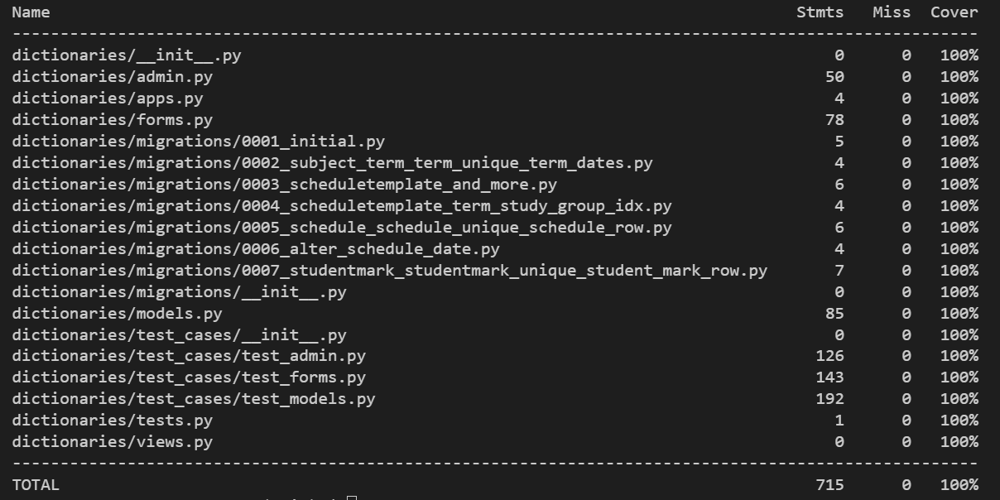
  **Main**
  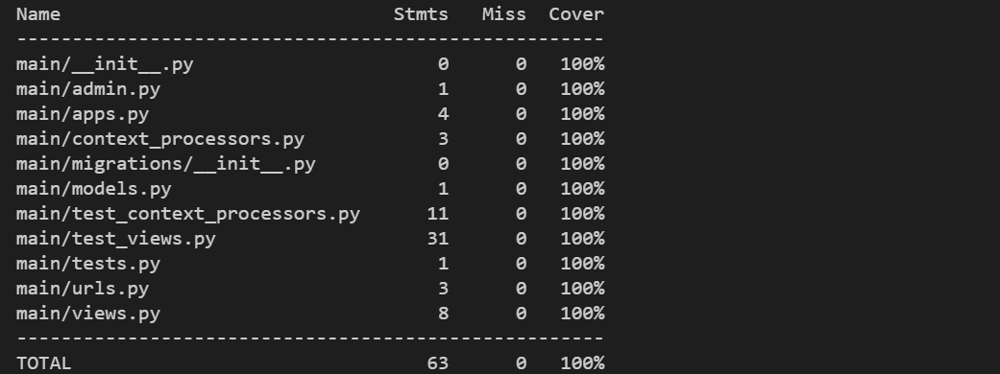

### Jest
1. **Prerequisites**
Before running the tests, make sure you have installed all the dependencies by running:
```
npm install
```
2. **Running the Tests**
To run the test suite, use the following command:
```
npm test
```
3. **Key Test Results**
After running the tests, here are the results obtained from the project:
- Command: `npm test`
- Output Summary:
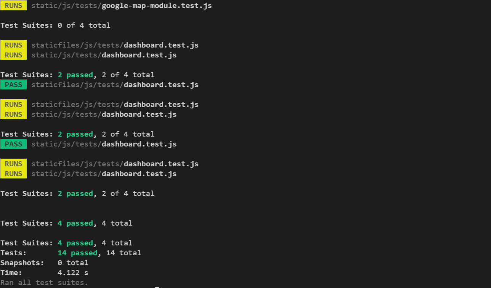

## Validation
### W3C Validator (HTML)
Quality checking was tested by [Markup validator service](https://validator.w3.org/)
All files were checked and did not have errors or warnings.
- the 'Home' page
 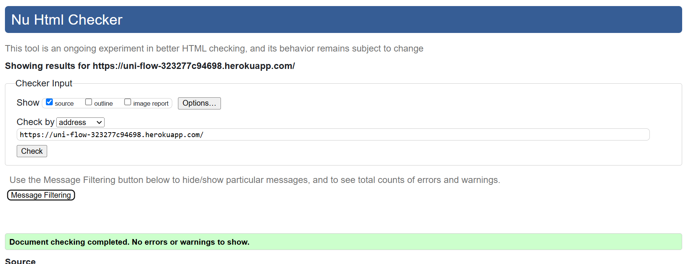
- the 'Contact' page
 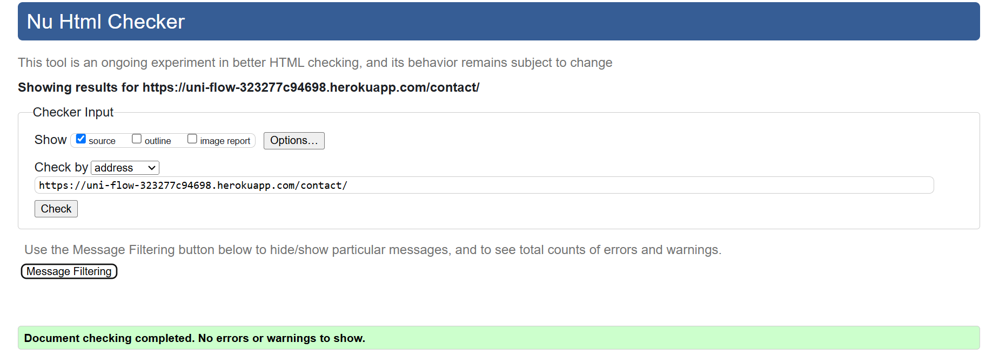

### W3C CSS Validator (CSS)
Quality checking was tested by [CSS validator service](https://jigsaw.w3.org/css-validator/).
All files were checked and did not have errors or warnings.
- style.css
 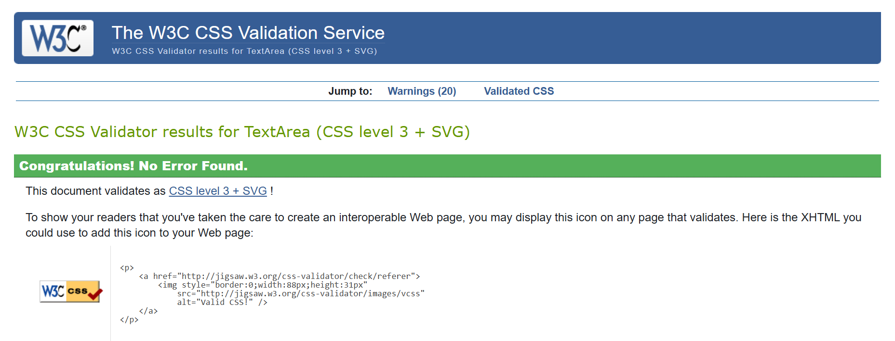

### JS Hint
Quality checking was tested by [JS Hint](https://jshint.com/).
All files were checked and did not have errors or warnings.
- dashboard.js
 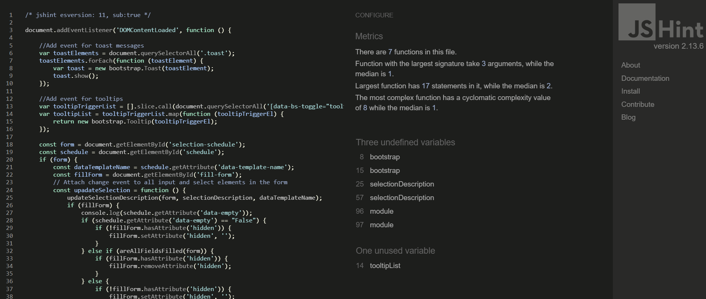
- google-map-module.js
 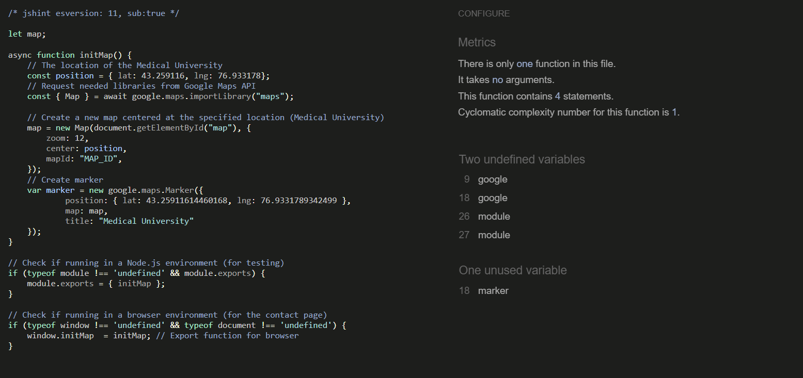
- tests/dashboard-test.js
 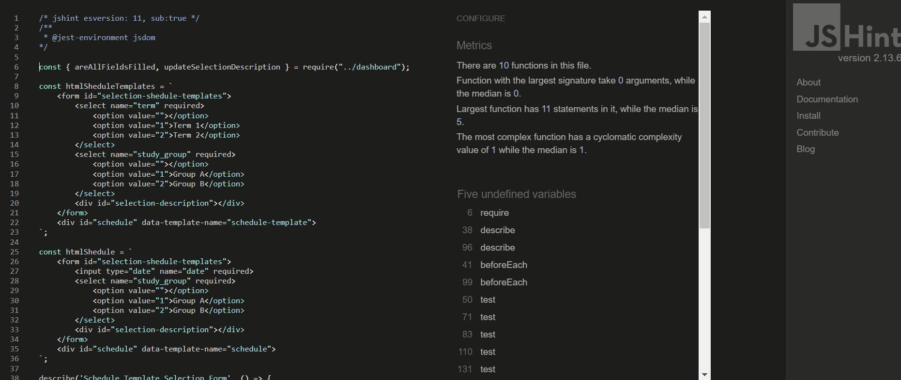
- tests/google-map-module.js
 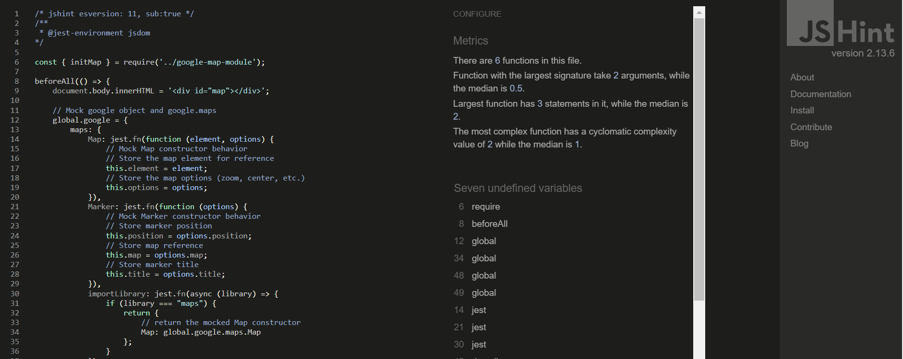

### Validator P8P (Python)
Quality checking was tested by [PEP8](https://pep8ci.herokuapp.com/#).
All files were checked and did not have errors or warnings.
Notes: Each Python file contains a newline at the end of the file.

**Dictionaries**
- admin.py
 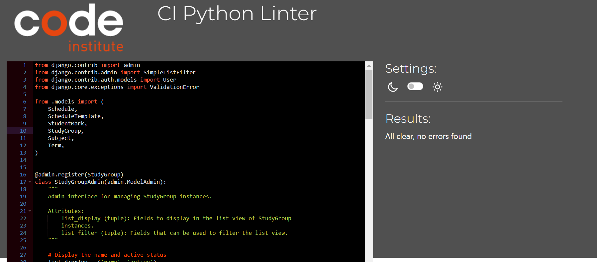
- apps.py
 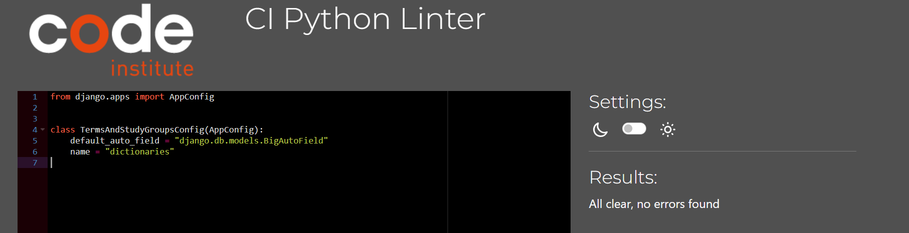
- forms.py
 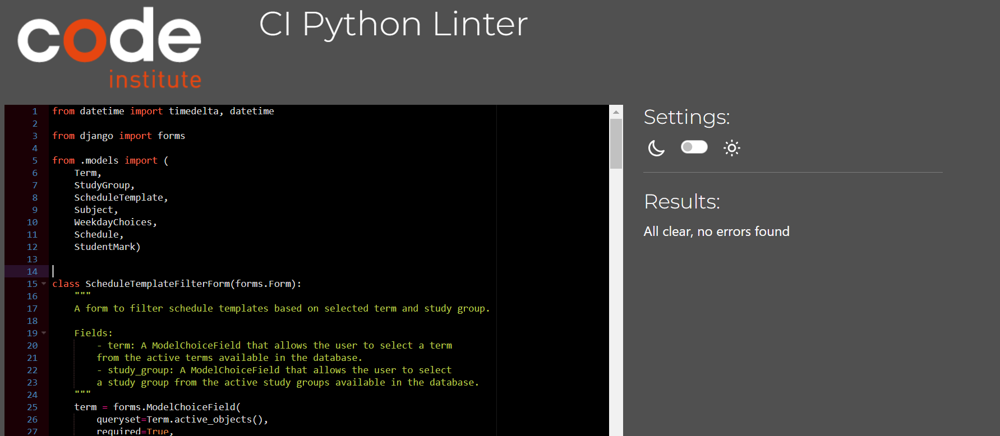
- models.py
 
- tests.py
 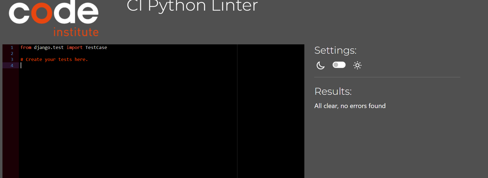
- test_cases/test-admin.py
 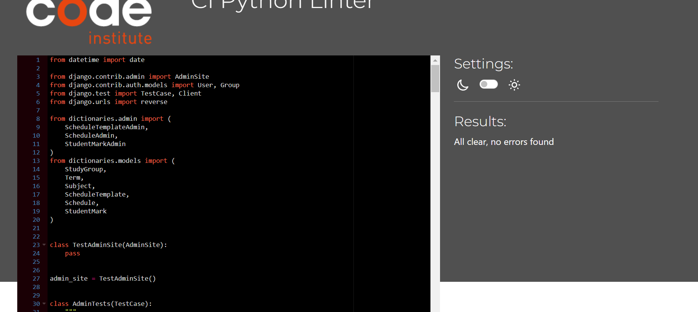
- test_cases/test-forms.py
 
- test_cases/test-models.py
 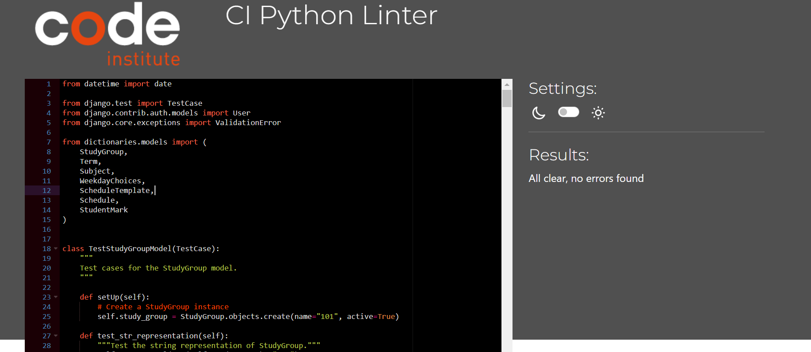

**Main**
- admin.py
 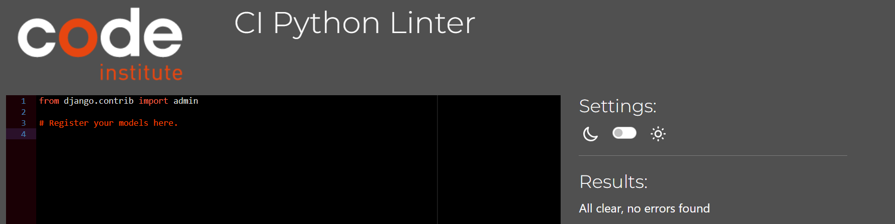
- apps.py
 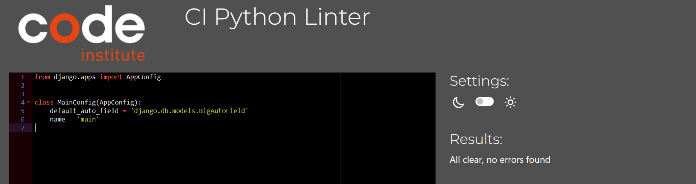
- context-processors.py
 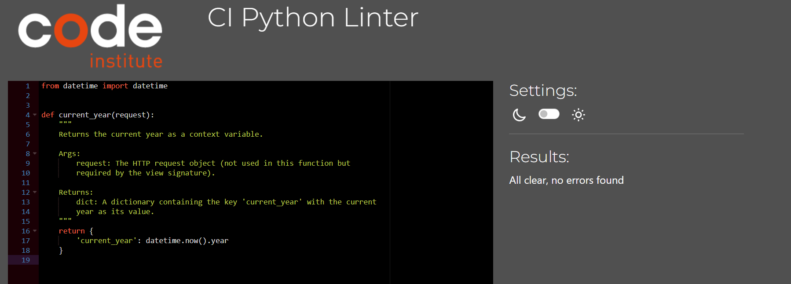
- models.py
 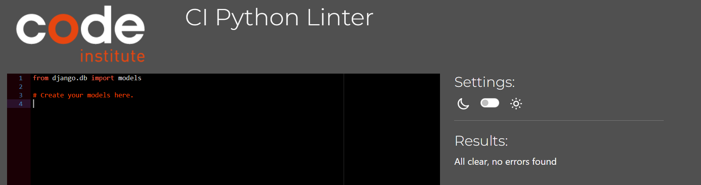
- test.py
 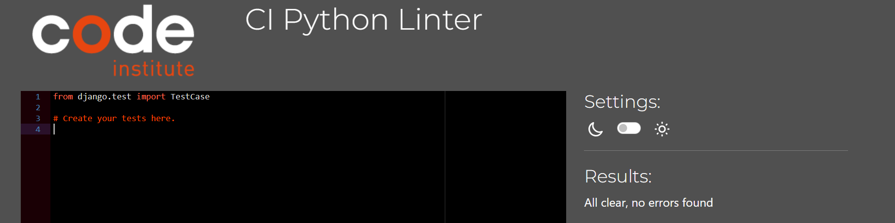
- urls.py
 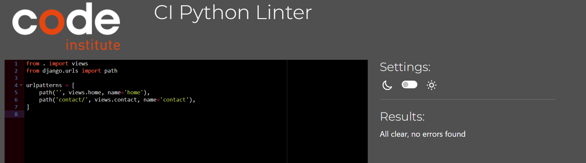
- views.py
 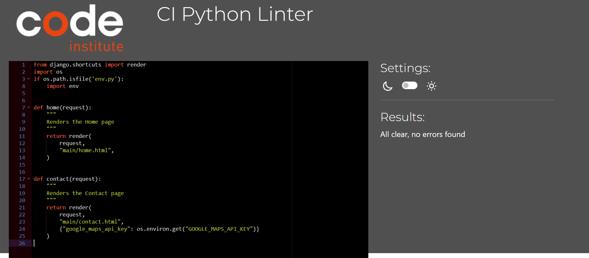
- test-cases/test-context-processors.py
 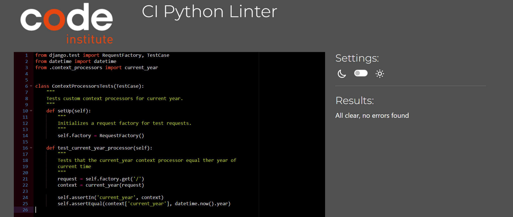
- test-cases/test-views.py
 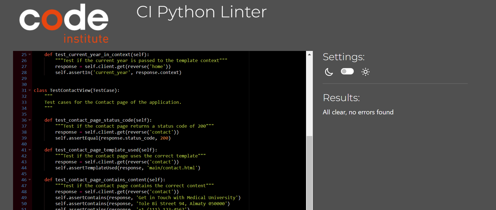