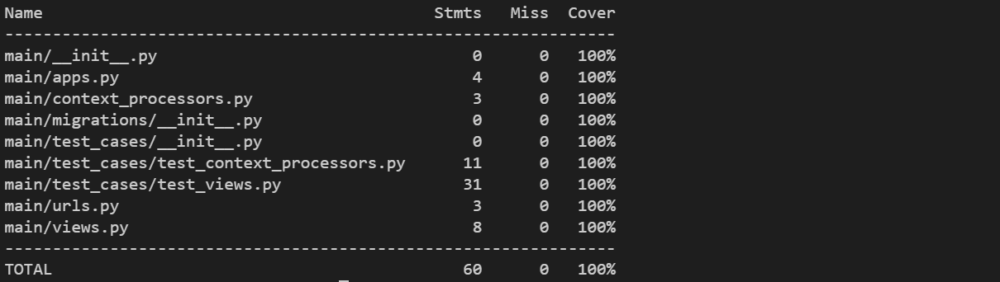
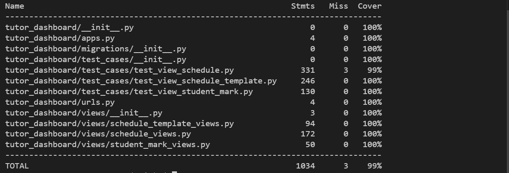

## TESTING

### Purpose Of Testing

The purpose of testing is to make sure the application does not have critical errors and works properly, providing a positive experience for the user.

__Functional Testing__

All the options were tested and worked correctly.

## Automated Testing
This project includes a suite of automated tests to ensure the functionality, reliability, and stability of the application. Below is an overview of the testing setup, the process, and the results.
### Django
1. **Running the Tests**
You can run the test suite using the Django management command:
```
python manage.py test
```
2. **Testing Structure**
The tests are located in a dedicated tests folder for each app. Below is an example of the folder structure:
```
app_name/
├── test-cases/
│   ├── test_models.py
│   ├── test_views.py
│   ├── ...
```
3. **Key Test Results**
After running the tests, here are the results obtained from the project:
- Command: `Python manage.py test`
- Output Summary:
**dictionaries**
```
----------------------------------------------------------------------
Ran 65 tests in 7.536s

OK
```
**main**
```
----------------------------------------------------------------------
Ran 9 tests in 0.317s

OK
```
**student_dashboard**
```
----------------------------------------------------------------------
Ran 0 tests in 0.000s

NO TESTS RAN
```
**tutor_dashboard**
```
----------------------------------------------------------------------
Ran 68 tests in 21.649s

OK
```
**users**
```
----------------------------------------------------------------------
Ran 14 tests in 3.807s

OK
```
- Code Coverage:
  - Prerequisites:
  Before getting reports, make sure you have installed all the dependencies by running:
  ```
  pip install coverage
  ```
  - Command:
  ```
  coverage run --source=app_name manage.py test app_name
  coverage report
  ```
  - Results:

  **dictionaries**
    
  **main**
    
  **student_dashboard**
    
  **tutor_dashboard**
    
  **users**
    

### Jest
1. **Prerequisites**
Before running the tests, make sure you have installed all the dependencies by running:
```
npm install
```
2. **Running the Tests**
To run the test suite, use the following command:
```
npm test
```
3. **Key Test Results**
After running the tests, here are the results obtained from the project:
- Command: `npm test`
- Output Summary:
  

## Validation
### W3C Validator (HTML)
Quality checking was tested by [Markup validator service](https://validator.w3.org/)
All files were checked and did not have errors.
These warnings do not indicate issues that would degrade the user experience or functionality of the application. The `aria-label` attributes were added deliberately to enhance accessibility for screen readers. The use of `aria-label` conforms to accessibility best practices by providing explicit descriptions when needed. The warnings do not affect the semantic correctness or performance of the application.
- the 'Home' page
  
- the 'Contact' page
  
- the 'Login' page
  
- the 'Register' page
  
- the 'Logout' page
  
- the 'Dashboard' page for students
  **Warnings**
  1. Possible misuse of `aria-label`
     `Location: Line 125`
     ```
     <span data-bs-toggle="tooltip" aria-label="Open instructions modal for dashboard usage tips" data-bs-original-title="Open instructions modal for dashboard usage tips">
     ```
      This warning is triggered because the `aria-label` duplicates the information provided by `data-bs-original-title`. However, the use of aria-label here is intentional to ensure accessibility for users relying on assistive technologies, as some screen readers may not fully interpret Bootstrap tooltips.
  2. Possible misuse of `aria-label`
    `Location: Line ...` the number of those warnings depends on the number of student's marks.
     ```
     <span class="badge text-bg-primary rounded-pill position-absolute end-0" aria-label="Your mark: 80 for Anatomy">
     ```
      This warning appears because the `aria-label` provides descriptive information that could also be visually apparent. However, it is intentionally included to ensure the information is accessible for users of screen readers, even if the visual context is unavailable.
  
- the 'Dashboard' page for tutors - button 'Schedule'
  **Warnings**
  1. Possible misuse of `aria-label`
     `Location: Line 109`
     ```
     <span data-bs-toggle="tooltip" aria-label="Open instructions modal for dashboard usage tips" data-bs-original-title="Open instructions modal for dashboard usage tips">
     ```
      This warning is triggered because the `aria-label` duplicates the information provided by `data-bs-original-title`. However, the use of aria-label here is intentional to ensure accessibility for users relying on assistive technologies, as some screen readers may not fully interpret Bootstrap tooltips.
  2. Possible misuse of `aria-label`
    `Location: Line ...` the number of those warnings depends on the number of student's marks.
     ```
     <span class="badge text-bg-primary rounded-pill position-absolute end-0" aria-label="Number of marks for this subject">
     ```
      This warning appears because the `aria-label` provides descriptive information that could also be visually apparent. However, it is intentionally included to ensure the information is accessible for users of screen readers, even if the visual context is unavailable.

  

- the 'Add shedule' page
  **Warnings**
  1. Possible misuse of `aria-label`
     `Location: Line 94`
     ```
     <span data-bs-toggle="tooltip" aria-label="Open instructions modal for dashboard usage tips" data-bs-original-title="Open instructions modal for dashboard usage tips">
     ```
      This warning is triggered because the `aria-label` duplicates the information provided by `data-bs-original-title`. However, the use of aria-label here is intentional to ensure accessibility for users relying on assistive technologies, as some screen readers may not fully interpret Bootstrap tooltips.

  

- the 'Edit shedule' page
  **Warnings**
  1. Possible misuse of `aria-label`
     `Location: Line 94`
     ```
     <span data-bs-toggle="tooltip" aria-label="Open instructions modal for dashboard usage tips" data-bs-original-title="Open instructions modal for dashboard usage tips">
     ```
      This warning is triggered because the `aria-label` duplicates the information provided by `data-bs-original-title`. However, the use of aria-label here is intentional to ensure accessibility for users relying on assistive technologies, as some screen readers may not fully interpret Bootstrap tooltips.

  

- the 'Dashboard' page for tutors - button 'Schedule template'
  **Warnings**
  1. Possible misuse of `aria-label`
     `Location: Line 109`
     ```
     <span data-bs-toggle="tooltip" aria-label="Open instructions modal for dashboard usage tips" data-bs-original-title="Open instructions modal for dashboard usage tips">
     ```
      This warning is triggered because the `aria-label` duplicates the information provided by `data-bs-original-title`. However, the use of aria-label here is intentional to ensure accessibility for users relying on assistive technologies, as some screen readers may not fully interpret Bootstrap tooltips.
  

- the 'Add shedule template' page
  **Warnings**
  1. Possible misuse of `aria-label`
     `Location: Line 94`
     ```
     <span data-bs-toggle="tooltip" aria-label="Open instructions modal for dashboard usage tips" data-bs-original-title="Open instructions modal for dashboard usage tips">
     ```
      This warning is triggered because the `aria-label` duplicates the information provided by `data-bs-original-title`. However, the use of aria-label here is intentional to ensure accessibility for users relying on assistive technologies, as some screen readers may not fully interpret Bootstrap tooltips.
  
  
- the 'Edit shedule template' page
  **Warnings**
  1. Possible misuse of `aria-label`
     `Location: Line 94`
     ```
     <span data-bs-toggle="tooltip" aria-label="Open instructions modal for dashboard usage tips" data-bs-original-title="Open instructions modal for dashboard usage tips">
     ```
      This warning is triggered because the `aria-label` duplicates the information provided by `data-bs-original-title`. However, the use of aria-label here is intentional to ensure accessibility for users relying on assistive technologies, as some screen readers may not fully interpret Bootstrap tooltips.
  

- the '403-error' page
  

- the '404-error' page
  

- the '500-error' page
  

### W3C CSS Validator (CSS)
Quality checking was tested by [CSS validator service](https://jigsaw.w3.org/css-validator/).
All files were checked and did not have errors or warnings.
- style.css
  

### JS Hint
Quality checking was tested by [JS Hint](https://jshint.com/).
All files were checked and did not have errors or warnings.
- dashboard.js
  
- google-map-module.js
  
- tests/dashboard-test.js
  
- tests/google-map-module.js
  

### Validator PEP8 (Python)
Quality checking was tested by [PEP8](https://pep8ci.herokuapp.com/#).
All files were checked and did not have errors or warnings.
Notes: Each Python file contains a newline at the end of the file.

**dictionaries**
- admin.py
  
- apps.py
  
- forms.py
  
- models.py
  
- tests.py
  
- test_cases/test-admin.py
  
- test_cases/test-forms.py
  
- test_cases/test-models.py
  

**main**
- admin.py
  
- apps.py
  
- context-processors.py
  
- models.py
  
- tests.py
  
- urls.py
  
- views.py
  
- test-cases/test-context-processors.py
  
- test-cases/test-views.py
  

**student_dashboard**
- admin.py
  
- apps.py
  
- models.py
  
- tests.py
  
- urls.py
  
- views.py
  

**tutor_dashboard**
- admin.py
  
- apps.py
  
- models.py
  
- tests.py
  
- urls.py
  
- test_cases/test_view_schedule_template.py
  
- test_cases/test_view_schedule.py
  
- test_cases/test_view_student_mark.py
  
- views/init.py
  
- views/schedule_template_views.py
  
- views/schedule_views.py
  
- views/student_mark_views.py
  

**users**
- admin.py
  
- apps.py
  
- context_processors.py
  
- forms.py
  
- models.py
  
- signals.py
    
- tests.py
  
- urls.py
  
- views.py
  
- test_cases/test_context_processors.py
  
- test_cases/test_forms.py
  
- test_cases/test_models.py
  
- test_cases/test_signals.py
  
- test_cases/test_views.py
  

