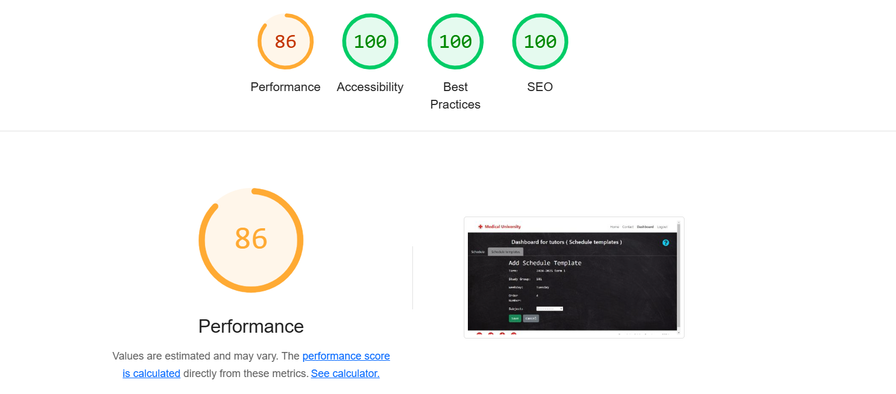
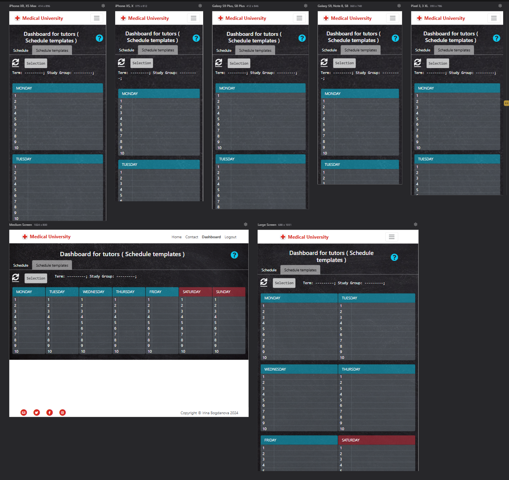
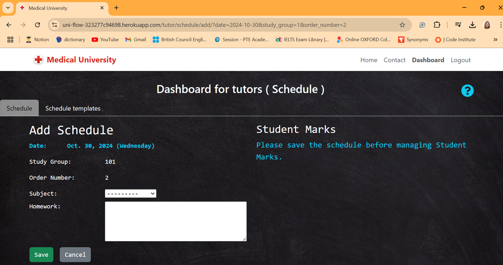
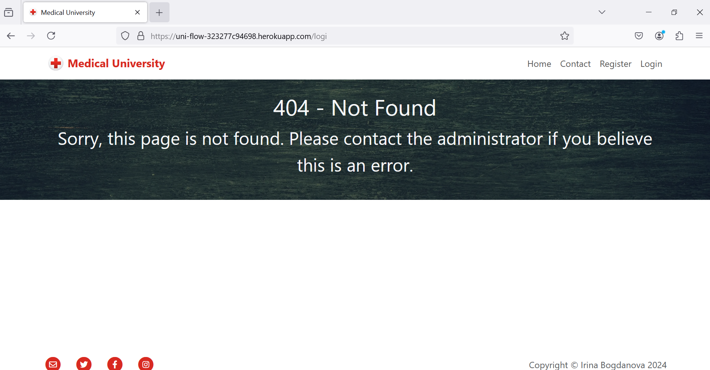
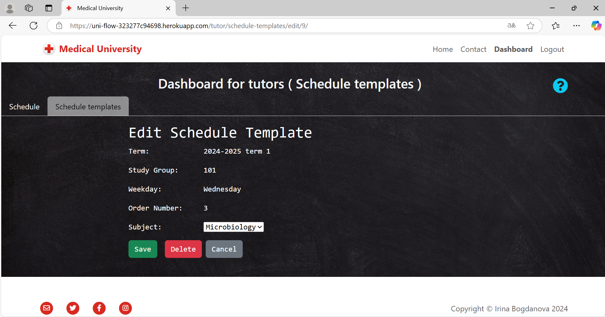
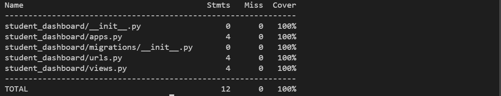

## TESTING

### Purpose Of Testing

The purpose of testing is to make sure the application does not have critical errors and works properly, providing a positive experience for the user.

## Functional Testing

Functional testing ensures that all features and functionalities of the application work as expected, regardless of the device or screen size.

| feature | action | expected result | tested | passed | comments |
| --- | --- | --- | --- | --- | --- |
| Navigation bar | View the navigation bar | The navigation bar is visible and contains links to main site sections. | | | |
| Logo and Logo name | Click the Logo link | The Logo link opens the Home page. | Yes | Yes | - |
|  | Hover over the Logo link on large devices | The Logo link changes color. | Yes | Yes | - |
| The Home link | Click the Home link | The Home link opens the Home page. | Yes | Yes | - |
|  | Hover over the Home link on large devices | The Home link changes color. | Yes | Yes | - |
| The Contact link | Click the Contact link | The Contact link opens the Contact page. | Yes | Yes | - |
|  | Hover over the Contact link on large devices | The Contact link changes color. | Yes | Yes | - |
| The Register link | Click the Register link | The Register link opens the Register page. | Yes | Yes | - |
|  | Hover over the Register link on large devices | The Register link changes color. | Yes | Yes | - |
| The Login link | Click the Login link | The Login link opens the Login page. | Yes | Yes | - |
|  | Hover over the Login link on large devices | The Login link changes color. | Yes | Yes | - |
| The Logout link | Click the Logout link | The Logout link opens the Logout page. | Yes | Yes | - |
|  | Hover over the Logout link on large devices | The Logout link changes color | Yes | Yes | - |
| The Dashboard link | Click the Dashboard link | The Dashboard link opens the Dashboard page | Yes | Yes | - |
|  | Hover over the Logout link on large devices | The Dashboard link changes color. | Yes | Yes | - |
| Footer | View the Footer section | Footer contains email and social media links. | | | |
| The E-mail link | Click the E-mail link | The E-mail link offers to choose an application to send e-mail. | Yes | Yes | - |
|  | Hover over the E-mail link on large devices | The E-mail link changes color. | Yes | Yes | - |
| The Twitter link | Click the Twitter link | The Twitter link opens the Twitter page. | Yes | Yes | - |
|  | Hover over the Twitter link on large devices | The Twitter link changes color. | Yes | Yes | - |
| The Facebook link | Click the Facebook link | The Facebook link opens the Facebook page. | Yes | Yes | - |
|  | Hover over the Facebook link on large devices | The Facebook link changes color. | Yes | Yes | - |
| The Instagram link | Click the Instagram link | The Instagram link opens the Instagram page | Yes | Yes | - |
|  | Hover over the Instagram link on large devices | The Instagram link changes color | Yes | Yes | - |
| The Home page | | | | | |
| The Home link | Navigates to the Home page | The Home link appears in bold font. | Yes | Yes | - |
| The content | Provides essential contact information | The Home page content includes a welcome message and introductory information about the website. | Yes | Yes | - |
| The Contact page | | | | | |
| The Contact link | Navigates to the Contact page |  The Contact link appears in bold font. | Yes | Yes | - |
| The content | Provides essential contact information | The content includes a map and detailed contact information (address, phone number, email). | Yes | Yes | - |
| The map | Displays the university's location | The map is embedded and displays the correct location using Google Maps integration. | Yes | Yes | - |
| The Login page | | | | | |
| The Login link | Navigates to the Login page | The Login link appears in bold font. | Yes | Yes | - |
| The content | Access the Login page | Includes a 'Sign up' link, a 'Sign in' button, a 'Remember me' checkbox, and two fields: 'Username' and 'Password'. | Yes | Yes | - |
| Login process | Authenticate a user | The user fills in the 'Username' and 'Password' fields, then clicks the 'Sign in' button. The system validates the input and displays relevant error messages if authentication fails. | Yes | Yes | - |
| the 'Remember me' checkbox | Enable browser to retain login credentials | The user selects the checkbox, fills in 'Username' and 'Password', and clicks 'Sign in'. The system remembers the credentials for future logins if authentication succeeds. | Yes | Yes | - |
| The Register page | | | | | |
| The Register link | Navigate to the Register page | The Register link appears in bold font | Yes | Yes | - |
| The content | Access the Register page | Includes a 'Sign in' link, a 'Sign up' button, and fields for 'Email', 'First name', 'Last name', 'Password', and 'Password (again)'. | Yes | Yes | - |
| Register process | Create a new user account | The user fills in all required fields and clicks the 'Sign up' button. If successful, the system creates a user with "Student" permissions and redirects them to the "Dashboard" page. If there are errors, the system displays detailed error messages.\. | Yes | Yes | - |
| The Logout page | | | | | |
| The Logout link | Navigate to the Logout page | The Logout link appears in bold font | Yes | Yes | - |
| The content | Go to the Logout page | The content has confirmation to sign out and an appropriate button. | Yes | Yes | - |
| The Sign-out button | Click the Sign-out button | The Sign-out button logs out. | Yes | Yes | - |
| The Dashboard page for students | | Displays schedule information and selection options | | | |
| The Dashboard link | Navigate to the Dashboard page | The Dashboard link has bold font | Yes | Yes | - |
| The content |  | The Dashboard displays an "Update" button, a "Selection" button, a "Instruction" button, cards with detailed schedule information, and an info-line about the applied selection. | Yes | Yes | - |
| Actions of the Selection button | Click the Selection button, fill in the fields, and click the Apply button. | The "Selection" button expands to reveal a form with "Date" and "Study group" fields. The "Study group" field is read-only and automatically set to the student's study group (from UserProfile). The "Date" field defaults to the current date. If the "Date" field is empty, the system prompts with "Please fill out the field." Upon valid submission, the schedule for the selected "Date" and "Study group" is displayed, with the info-line showing the applied selection. | Yes | Yes | - |
| Displaying schedule | Apply the 'Selection' form | The schedule correctly displays subjects, homework, and student marks in order of occurrence and date. Homework entries include an arrow icon and a hover effect. Clicking expands the homework details. Marks are displayed as badges with accurate values. | | | |
| The Update button | Click the Update button | Refreshes the schedule information with the latest data for the current selection. | Yes | Yes | - |
| The Instruction button | Click the Instruction button | Opens a modal with detailed instructions on how to use the form, including steps to select a schedule and view its details. | Yes | Yes | - |
| The Dashboard page for tutors | | | | | |
| The content | Go to the Dashboard page | The page contains a navigation bar with the following tabs: 'Schedule', 'Schedule Template', and an 'Instruction' button. | Yes | Yes | - |
| The Dashboard link | Click the Dashboard link | The Dashboard link has bold font | Yes | Yes | - |
| Schedule Tab | Click the 'Schedule' tab | the 'Schedule' tab changes the background color and loads its associated content. | Yes | Yes | - |
| Schedule Template tab | Click the 'Schedule Template' tab | the 'Schedule Template' tab changes the background color and loads its associated content. | Yes | Yes | - |
| The Instruction button | Click the Instruction button | Displays a modal providing instructions for navigating and using the currently active tab. | Yes | Yes | - |
| Schedule Template tab | | | | | |
| Schedule Template Content | Go to the Schedule Template tab | Displays an "Update" button, a "Selection" button, a "Instruction" button, cards with detailed schedule information, and an info-line about the applied selection. | Yes | Yes | - |
| Actions of the Selection button | Click the Selection button, fill in the fields, and click the Apply button. | The "Selection" button expands to reveal a form with "Term" and "Study group" fields. If the "Term" or "Study group" field is empty, the system prompts with "Please fill out the field." Upon valid submission, the schedule template for the selected "Term" and "Study group" is displayed, with the info-line showing the applied selection. | Yes | Yes | - |
| Displaying schedule template | Apply the 'Selection' form | Correctly renders subjects in the specified order for the selected weekday. Subjects have a hover effect that changes the background color. Clicking a subject opens the 'Add Schedule Template' page for empty entries and the 'Edit Schedule Template' page for existing entries. | | | |
| The Update button | Click the Update button | Refreshes the schedule templae information with the latest data for the current selection. | Yes | Yes | - |
| The 'Add schedule template' page | | | | | |
| The content | Go to the 'Add schedule template' page | The page displays the following elements: 'Save' button, 'Cancel' button, 'Subject' field, and the following info fields: 'Term', 'Study Group', 'Weekday', 'Order Number'. All info fields show correct values. | Yes | Yes | - |
| The Save button | Click the Save button | The system checks that the 'Subject' field is filled, saves the new object to the database, and redirects to the 'Schedule Template' page. | Yes | Yes | - |
| The Cancel button | Click the Cancel button | The system redirects to the 'Schedule Template' page without making any changes. | Yes | Yes | - |
| The 'Edit schedule template' page | | | | | |
| The content | Go to the 'Edit schedule template' page | The page displays the following elements: 'Save' button, 'Cancel' button, 'Delete' button, 'Subject' field, and the info fields: 'Term', 'Study Group', 'Weekday', 'Order Number'. The info fields display the correct values, and 'Subject' is pre-filled with the current value. | Yes | Yes | - |
| The Save button | Click the Save button | The system checks that the 'Subject' field is filled, updates the current object in the database, and redirects to the 'Schedule Template' page. | Yes | Yes | - |
| The Cancel button | Click the Cancel button | The system redirects to the 'Schedule Template' page without making any changes. | Yes | Yes | - |
| The Delete button | Click the Delete button | The system prompts the user with a confirmation modal. If confirmed, the current object is deleted and the system redirects to the 'Schedule Template' page. | Yes | Yes | - |
| Schedule tab | | | | | |
| The content | Go to the Schedule bookmark | Displays an "Update" button, a "Selection" button, a "Fill" button, a "Instruction" button, cards with detailed schedule information, and an info-line about the applied selection. | Yes | Yes | - |
| Actions of the Selection button | Click the Selection button, fill in the fields, and click the Apply button. | The "Selection" button expands to reveal a form with "Date" and "Study group" fields. The "Date" field defaults to the current date. If the "Date" field is empty, the system prompts with "Please fill out the field." Upon valid submission, the schedule for the selected "Date" and "Study group" is displayed, with the info-line showing the applied selection. | Yes | Yes | - |
| Displaying schedule | Apply the 'Selection' form | The schedule displays subjects, homework, and a badge showing the number of student marks in the correct order and date. The subject and homework cells have a hover effect, changing the background color. When the user clicks on a subject or homework, the system checks if the selection is valid. If valid, it opens the 'Add Schedule' page for empty fields and the 'Edit Schedule' page for filled fields. | Yes | Yes | |
| The Update button | Click the Update button | Refreshes the schedule information with the latest data for the current selection. | Yes | Yes | - |
| The Fill button | Click the Fill button | The Fill button appears only if the schedule is empty. When clicked, it automatically fills the schedule according to the schedule template based on the selected date and study group. | Yes | Yes | - |
| The 'Add schedule' page | | | | | |
| The content | Go to the 'Add schedule' page | Displays the 'Save' and 'Cancel' buttons, the 'Subject' and 'Homework' fields, and information fields: 'Term', 'Study group', 'Weekday', and 'Order number'. The information fields contain correct values. | Yes | Yes | - |
| The Save button | Click the Save button | The system verifies that the 'Subject' field is filled, saves a new object in the database, and redirects to the 'Edit Schedule' page. | Yes | Yes | - |
| The Cancel button | Click the Cancel button |The system redirects to the 'Schedule' page without making any changes. | Yes | Yes | - |
| The 'Edit schedule' page | | | | | |
| The content | Go to the Dashboard page | Displays the 'Save', 'Cancel', and 'Delete' buttons, the 'Subject' field, and information fields: 'Term', 'Study group', 'Weekday', and 'Order number'. The 'Subject' field matches the current value.| Yes | Yes | - |
| The Save button | Click the Save button | The system verifies that the 'Subject' field is filled, updates the current object in the database, and redirects to the 'Schedule' page. | Yes | Yes | - |
| The Cancel button | Click the Cancel button | The system redirects to the 'Schedule' page without making any changes. | Yes | Yes | - |
| The Delete button | Click the Delete button | The system deletes the current object and redirects to the 'Schedule' page. | Yes | Yes | - |
| Working with Student Marks | | In the 'Edit Schedule' page, student marks are displayed in a table below the schedule details. The table shows each student's name, their mark, and options to edit or delete marks. | | | |
| Add New Mark | Click the 'Add' button in the Student Marks section | A modal appears where you can select a student and enter their mark. After submission, the new mark is added to the schedule and displayed in the table. | Yes | Yes | - |
| Edit Mark | Click the 'Edit' button next to a mark | A modal appears with pre-filled data for the selected student and mark. Changes are saved to the database once the form is submitted. | Yes | Yes | - |
| Delete Mark | Click the 'Delete' button next to a mark |A modal appears asking for confirmation to delete the selected mark. Once confirmed, the mark is deleted from the database. | Yes | Yes | - |
| No Marks | No Marks | A message is displayed saying "No marks available." | - |

## Admin Panel Functional Testing

Admin panel testing ensures that the admin interface works as expected and provides the correct functionality for managing the application's data.

| feature | action  | expected result  | tested | passed | comments |
|---|---|---|----|---|---|
| Admin login | Log in using admin credentials | Successfully logs into the admin panel. | Yes | Yes | - |
| Add StudyGroup | Navigate to the StudyGroup section and click 'Add' | The 'StudyGroup' creation form opens with fields for 'name' and 'active' status. | Yes | Yes | - |
| Add StudyGroup (form submit) | Fill the form and click 'Save' | The system saves the new 'StudyGroup' and redirects to the list view of study groups. | Yes | Yes | - |
| Edit StudyGroup | Click the 'Edit' button for an existing StudyGroup | The 'StudyGroup' edit form opens with the current values pre-filled. | Yes | Yes | - |
| Edit StudyGroup (form submit)  | Modify the fields and click 'Save' | The system updates the 'StudyGroup' and redirects to the list view with the updated information. | Yes | Yes | - |
| Delete StudyGroup | Click the 'Delete' button for an existing StudyGroup | The system asks for confirmation to delete the 'StudyGroup'. Upon confirmation, the 'StudyGroup' is deleted. | Yes | Yes | - |
| Add Term | Navigate to the Term section and click 'Add' | The 'Term' creation form opens with fields for 'name', 'date_from', 'date_to', and 'active' status. | Yes | Yes | - |
| Add Term (form submit)  | Fill the form and click 'Save' | The system saves the new 'Term' and redirects to the list view of terms. | Yes | Yes | - |
| Edit Term | Click the 'Edit' button for an existing Term | The 'Term' edit form opens with the current values pre-filled. | Yes | Yes | - |
| Edit Term (form submit) | Modify the fields and click 'Save' | The system updates the 'Term' and redirects to the list view with the updated information. | Yes | Yes | - |
| Delete Term  | Click the 'Delete' button for an existing Term | The system asks for confirmation to delete the 'Term'. Upon confirmation, the 'Term' is deleted. | Yes | Yes | - |
| Add Subject | Navigate to the Subject section and click 'Add' | The 'Subject' creation form opens with fields for 'name' and 'active' status. | Yes | Yes | - |
| Add Subject (form submit) | Fill the form and click 'Save' | The system saves the new 'Subject' and redirects to the list view of subjects. | Yes | Yes | - |
| Edit Subject | Click the 'Edit' button for an existing Subject | The 'Subject' edit form opens with the current values pre-filled. | Yes | Yes | - |
| Edit Subject (form submit) | Modify the fields and click 'Save' | The system updates the 'Subject' and redirects to the list view with the updated information. | Yes | Yes | - |
| Delete Subject | Click the 'Delete' button for an existing Subject | The system asks for confirmation to delete the 'Subject'. Upon confirmation, the 'Subject' is deleted. | Yes | Yes | - |
| Add ScheduleTemplate | Navigate to the ScheduleTemplate section and click 'Add' | The 'ScheduleTemplate' creation form opens with fields for 'term', 'study_group', 'weekday', 'order_number', and 'subject'. | Yes | Yes | - |
| Add ScheduleTemplate (form submit) | Fill the form and click 'Save' | The system saves the new 'ScheduleTemplate' and redirects to the list view of schedule templates. | Yes | Yes | - |
| Edit ScheduleTemplate | Click the 'Edit' button for an existing ScheduleTemplate | The 'ScheduleTemplate' edit form opens with the current values pre-filled. | Yes | Yes | - |
| Edit ScheduleTemplate (form submit) | Modify the fields and click 'Save' | The system updates the 'ScheduleTemplate' and redirects to the list view with the updated information. | Yes | Yes | - |
| Delete ScheduleTemplate | Click the 'Delete' button for an existing ScheduleTemplate | The system asks for confirmation to delete the 'ScheduleTemplate'. Upon confirmation, the 'ScheduleTemplate' is deleted. | Yes | Yes | - |

### Admin Panel Access Control

| feature | action | expected result  | tested | passed | comments |
|---|---|---|---|---|---|
| Admin login without permissions | Log in as a non-admin user | The system prevents access to the admin panel and redirects to the home page or appropriate page. | Yes | Yes | - |
| Access control on models | Log in as an admin user and navigate to various models (StudyGroup, Term, Subject, ScheduleTemplate) | The admin user has access to all models, can add/edit/delete data, and access restricted functionalities. | Yes | Yes | - |

## Performance Testing
To ensure the application is optimized and performs efficiently, we use **[Lighthouse](https://developers.google.com/web/tools/lighthouse)** for performance testing. 

Lighthouse is an open-source, automated tool for improving the quality of web pages. It provides insights and metrics across several categories, including:

1. **Performance**: Evaluates load times, speed indices, and how quickly key content is displayed.
2. **Accessibility**: Checks the site's compliance with accessibility standards.
3. **Best Practices**: Analyzes adherence to modern web development practices.
4. **SEO**: Assesses the website's ability to rank on search engines.
5. **Progressive Web App (PWA)**: Verifies the features and reliability of a PWA (if applicable).
- the 'Home' page
  
- the 'Contact' page
  
- the 'Login' page
  
- the 'Register' page
  
- the 'Logout' page
  
- the 'Dashboard' page for students
  
- the 'Dashboard' page for tutors - button 'Schedule'
  
- the 'Add shedule' page
  
- the 'Edit shedule' page
  
- the 'Dashboard' page for tutors - button 'Schedule template'
  
- the 'Add shedule template' page
  
- the 'Edit shedule template' page
  
- the '403-error' page
  
- the '404-error' page
  

## User Interface Testing

Ensuring a consistent and responsive user interface across different screen sizes is crucial for an optimal user experience. Here are the steps and considerations for UI testing:

### Displaying on Different Screens
The application was tested on various screen sizes and devices to ensure responsiveness and usability:
1. **Desktop Screens**: Verify layout and design on common resolutions like 1920x1080 and 1366x768.
2. **Tablet Screens**: Check functionality and layout for resolutions such as 768x1024 (portrait) and 1024x768 (landscape).
3. **Mobile Screens**: Test responsiveness on small screens like 360x640 and 375x667.
- the 'Home' page
  
- the 'Contact' page
  
- the 'Login' page
  
- the 'Register' page
  
- the 'Logout' page
  
- the 'Dashboard' page for students
  
- the 'Dashboard' page for tutors - button 'Schedule'
  
- the 'Add shedule' page
  
- the 'Edit shedule' page
  
- the 'Dashboard' page for tutors - button 'Schedule template'
  
- the 'Add shedule template' page
  
- the 'Edit shedule template' page
  
- the '403-error' page
  
- the '404-error' page
  

### Testing on Different Browsers
The following browsers are commonly tested to ensure broad compatibility:
**Google Chrome**: Latest version and recent updates.
- the 'Home' page
  
- the 'Contact' page
  
- the 'Login' page
  
- the 'Register' page
  
- the 'Logout' page
  
- the 'Dashboard' page for students
  
- the 'Dashboard' page for tutors - button 'Schedule'
  
- the 'Add shedule' page
  
- the 'Edit shedule' page
  
- the 'Dashboard' page for tutors - button 'Schedule template'
  
- the 'Add shedule template' page
  
- the 'Edit shedule template' page
  
- the '403-error' page
  
- the '404-error' page
  

**Mozilla Firefox**: Standard version and ESR (Extended Support Release).
- the 'Home' page
  
- the 'Contact' page
  
- the 'Login' page
  
- the 'Register' page
  
- the 'Logout' page
  
- the 'Dashboard' page for students
  
- the 'Dashboard' page for tutors - button 'Schedule'
  
- the 'Add shedule' page
  
- the 'Edit shedule' page
  
- the 'Dashboard' page for tutors - button 'Schedule template'
  
- the 'Add shedule template' page
  
- the 'Edit shedule template' page
  
- the '403-error' page
  
- the '404-error' page
  

**Microsoft Edge**: Chromium-based versions.
- the 'Home' page
  
- the 'Contact' page
  
- the 'Login' page
  
- the 'Register' page
  
- the 'Logout' page
  
- the 'Dashboard' page for students
  
- the 'Dashboard' page for tutors - button 'Schedule'
  
- the 'Add shedule' page
  
- the 'Edit shedule' page
  
- the 'Dashboard' page for tutors - button 'Schedule template'
  
- the 'Add shedule template' page
  
- the 'Edit shedule template' page
  
- the '403-error' page
  
- the '404-error' page
  

## Automated Testing
This project includes a suite of automated tests to ensure the functionality, reliability, and stability of the application. Below is an overview of the testing setup, the process, and the results.
### Django
1. **Running the Tests**
You can run the test suite using the Django management command:
```
python manage.py test
```
2. **Testing Structure**
The tests are located in a dedicated tests folder for each app. Below is an example of the folder structure:
```
app_name/
├── test-cases/
│   ├── test_models.py
│   ├── test_views.py
│   ├── ...
```
3. **Key Test Results**
After running the tests, here are the results obtained from the project:
- Command: `Python manage.py test`
- Output Summary:
**dictionaries**
```
----------------------------------------------------------------------
Ran 65 tests in 7.536s

OK
```
**main**
```
----------------------------------------------------------------------
Ran 9 tests in 0.317s

OK
```
**student_dashboard**
```
----------------------------------------------------------------------
Ran 0 tests in 0.000s

NO TESTS RAN
```
**tutor_dashboard**
```
----------------------------------------------------------------------
Ran 68 tests in 21.649s

OK
```
**users**
```
----------------------------------------------------------------------
Ran 14 tests in 3.807s

OK
```
- Code Coverage:
  - Prerequisites:
  Before getting reports, make sure you have installed all the dependencies by running:
  ```
  pip install coverage
  ```
  - Command:
  ```
  coverage run --source=app_name manage.py test app_name
  coverage report
  ```
  - Results:

  **dictionaries**
    
  **main**
    
  **student_dashboard**
    
  **tutor_dashboard**
    
  **users**
    

### Jest
1. **Prerequisites**
Before running the tests, make sure you have installed all the dependencies by running:
```
npm install
```
2. **Running the Tests**
To run the test suite, use the following command:
```
npm test
```
3. **Key Test Results**
After running the tests, here are the results obtained from the project:
- Command: `npm test`
- Output Summary:
  

## Validation
### W3C Validator (HTML)
Quality checking was tested by [Markup validator service](https://validator.w3.org/)
All files were checked and did not have errors.
These warnings do not indicate issues that would degrade the user experience or functionality of the application. The `aria-label` attributes were added deliberately to enhance accessibility for screen readers. The use of `aria-label` conforms to accessibility best practices by providing explicit descriptions when needed. The warnings do not affect the semantic correctness or performance of the application.
- the 'Home' page
  
- the 'Contact' page
  
- the 'Login' page
  
- the 'Register' page
  
- the 'Logout' page
  
- the 'Dashboard' page for students
  **Warnings**
  1. Possible misuse of `aria-label`
     `Location: Line 125`
     ```
     <span data-bs-toggle="tooltip" aria-label="Open instructions modal for dashboard usage tips" data-bs-original-title="Open instructions modal for dashboard usage tips">
     ```
      This warning is triggered because the `aria-label` duplicates the information provided by `data-bs-original-title`. However, the use of aria-label here is intentional to ensure accessibility for users relying on assistive technologies, as some screen readers may not fully interpret Bootstrap tooltips.
  2. Possible misuse of `aria-label`
    `Location: Line ...` the number of those warnings depends on the number of student's marks.
     ```
     <span class="badge text-bg-primary rounded-pill position-absolute end-0" aria-label="Your mark: 80 for Anatomy">
     ```
      This warning appears because the `aria-label` provides descriptive information that could also be visually apparent. However, it is intentionally included to ensure the information is accessible for users of screen readers, even if the visual context is unavailable.
  
- the 'Dashboard' page for tutors - button 'Schedule'
  **Warnings**
  1. Possible misuse of `aria-label`
     `Location: Line 109`
     ```
     <span data-bs-toggle="tooltip" aria-label="Open instructions modal for dashboard usage tips" data-bs-original-title="Open instructions modal for dashboard usage tips">
     ```
      This warning is triggered because the `aria-label` duplicates the information provided by `data-bs-original-title`. However, the use of aria-label here is intentional to ensure accessibility for users relying on assistive technologies, as some screen readers may not fully interpret Bootstrap tooltips.
  2. Possible misuse of `aria-label`
    `Location: Line ...` the number of those warnings depends on the number of student's marks.
     ```
     <span class="badge text-bg-primary rounded-pill position-absolute end-0" aria-label="Number of marks for this subject">
     ```
      This warning appears because the `aria-label` provides descriptive information that could also be visually apparent. However, it is intentionally included to ensure the information is accessible for users of screen readers, even if the visual context is unavailable.

  

- the 'Add shedule' page
  **Warnings**
  1. Possible misuse of `aria-label`
     `Location: Line 94`
     ```
     <span data-bs-toggle="tooltip" aria-label="Open instructions modal for dashboard usage tips" data-bs-original-title="Open instructions modal for dashboard usage tips">
     ```
      This warning is triggered because the `aria-label` duplicates the information provided by `data-bs-original-title`. However, the use of aria-label here is intentional to ensure accessibility for users relying on assistive technologies, as some screen readers may not fully interpret Bootstrap tooltips.

  

- the 'Edit shedule' page
  **Warnings**
  1. Possible misuse of `aria-label`
     `Location: Line 94`
     ```
     <span data-bs-toggle="tooltip" aria-label="Open instructions modal for dashboard usage tips" data-bs-original-title="Open instructions modal for dashboard usage tips">
     ```
      This warning is triggered because the `aria-label` duplicates the information provided by `data-bs-original-title`. However, the use of aria-label here is intentional to ensure accessibility for users relying on assistive technologies, as some screen readers may not fully interpret Bootstrap tooltips.

  

- the 'Dashboard' page for tutors - button 'Schedule template'
  **Warnings**
  1. Possible misuse of `aria-label`
     `Location: Line 109`
     ```
     <span data-bs-toggle="tooltip" aria-label="Open instructions modal for dashboard usage tips" data-bs-original-title="Open instructions modal for dashboard usage tips">
     ```
      This warning is triggered because the `aria-label` duplicates the information provided by `data-bs-original-title`. However, the use of aria-label here is intentional to ensure accessibility for users relying on assistive technologies, as some screen readers may not fully interpret Bootstrap tooltips.
  

- the 'Add shedule template' page
  **Warnings**
  1. Possible misuse of `aria-label`
     `Location: Line 94`
     ```
     <span data-bs-toggle="tooltip" aria-label="Open instructions modal for dashboard usage tips" data-bs-original-title="Open instructions modal for dashboard usage tips">
     ```
      This warning is triggered because the `aria-label` duplicates the information provided by `data-bs-original-title`. However, the use of aria-label here is intentional to ensure accessibility for users relying on assistive technologies, as some screen readers may not fully interpret Bootstrap tooltips.
  
  
- the 'Edit shedule template' page
  **Warnings**
  1. Possible misuse of `aria-label`
     `Location: Line 94`
     ```
     <span data-bs-toggle="tooltip" aria-label="Open instructions modal for dashboard usage tips" data-bs-original-title="Open instructions modal for dashboard usage tips">
     ```
      This warning is triggered because the `aria-label` duplicates the information provided by `data-bs-original-title`. However, the use of aria-label here is intentional to ensure accessibility for users relying on assistive technologies, as some screen readers may not fully interpret Bootstrap tooltips.
  

- the '403-error' page
  

- the '404-error' page
  

- the '500-error' page
  

### W3C CSS Validator (CSS)
Quality checking was tested by [CSS validator service](https://jigsaw.w3.org/css-validator/).
All files were checked and did not have errors or warnings.
- style.css
  

### JS Hint
Quality checking was tested by [JS Hint](https://jshint.com/).
All files were checked and did not have errors or warnings.
- dashboard.js
  
- google-map-module.js
  
- tests/dashboard-test.js
  
- tests/google-map-module.js
  

### Validator PEP8 (Python)
Quality checking was tested by [PEP8](https://pep8ci.herokuapp.com/#).
All files were checked and did not have errors or warnings.
Notes: Each Python file contains a newline at the end of the file.

**dictionaries**
- admin.py
  
- apps.py
  
- forms.py
  
- models.py
  
- test_cases/test-admin.py
  
- test_cases/test-forms.py
  
- test_cases/test-models.py
  

**main**
- apps.py
  
- context-processors.py
  
- urls.py
  
- views.py
  
- test-cases/test-context-processors.py
  
- test-cases/test-views.py
  

**student_dashboard**
- apps.py
  
- urls.py
  
- views.py
  

**tutor_dashboard**
- apps.py
  
- urls.py
  
- test_cases/test_view_schedule_template.py
  
- test_cases/test_view_schedule.py
  
- test_cases/test_view_student_mark.py
  
- views/init.py
  
- views/schedule_template_views.py
  
- views/schedule_views.py
  
- views/student_mark_views.py
  

**users**
- admin.py
  
- apps.py
  
- context_processors.py
  
- forms.py
  
- models.py
  
- signals.py
    
- urls.py
  
- views.py
  
- test_cases/test_context_processors.py
  
- test_cases/test_forms.py
  
- test_cases/test_models.py
  
- test_cases/test_signals.py
  
- test_cases/test_views.py
  

## Bugs

__Solved Bugs__

 - When the user does not fill in 'date' field in the selection and then clicks on the "Fill" button, the system displays an error.
  Solution: Add the condition which checks it.
  ```
  <input type="hidden" name="date"  value="{{ form.date.value }}" >
  <input type="hidden" name="study_group"  value="{{ form.study_group.value }}" >
  ```
   Solution: Use window.innerHeight - lengthShip as the edge of the screen
 - The system did not display correct current year in the footer.
  Solution: Use global context to display it.
  ```
   TEMPLATES = [
    {
        'BACKEND': 'django.template.backends.django.DjangoTemplates',
        'DIRS': [TEMPLATES_DIR],
        'APP_DIRS': True,
        'OPTIONS': {
            'context_processors': [
                'django.template.context_processors.debug',
                'django.template.context_processors.request',
                'django.contrib.auth.context_processors.auth',
                'django.contrib.messages.context_processors.messages',
                'users.context_processors.user_groups',
                'main.context_processors.current_year',
            ],
        },
    },
   ]
  ```
 - When the user does not fill in the selection and then click on a cell to add new schedule template or schedule, the system opened the 'Add schedule' page.
  Solution: Checking the selection and do nothing if the selection is not selected.

  ```
  <a href="?date={{ weekday_info.date_str }}&study_group={{ form.study_group.value }}&order_number={{ order }}#" class="text-decoration-none text-reset" aria-label="Add new schedule for date {{ weekday_info.date }} and study group {{ form.study_group.value }}">
  ``` 
   
__Unsolved Bugs__

 - None.

__Mistakes__

 - Using different formats of 'Commit' comments.
 - Some grammar and spelling mistakes.